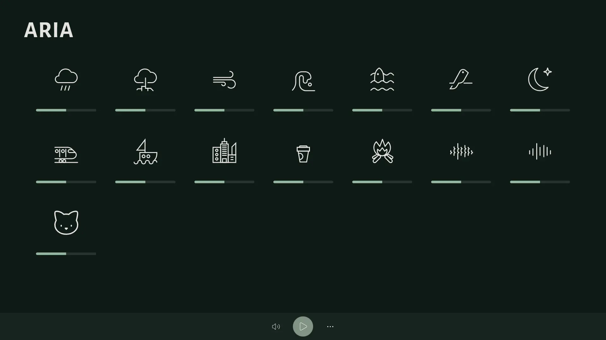

Nature’s silent symphony.
---

**Aria** is an ambient sound app.

Built from scratch using [Compose Multiplatform](https://github.com/JetBrains/compose-multiplatform), **Aria** is designed to flow across platforms. From Linux to Windows, from macOS to Web, while honoring the quiet beauty of the original [Blanket app](https://github.com/rafaelmardojai/blanket), built by Rafael Mardojai for the GNOME desktop.

---

## 🌺 Goal of this project:

**Aria’s mission is simple:**  
To bring peace, calm, and ambient beauty — to more people, on more platforms. Blanket is currently only available for Linux and I wanted to bring it to the rest of the world.

This isn’t a fork or a reimplementation. It’s a handcrafted tribute.

A quiet attempt to capture the essence of **Blanket**, but retold with different tools, for different platforms, and with a different heartbeat — mine.

---

## 🌼 Features

- 🎵 A curated library of ambient nature sounds: rain, fire, birds, forest, and more
- 🎚 Per-sound volume sliders + master volume control
- 🕰 Built-in timer to gently fade out after a chosen duration (perfect for sleep)
- 💻 Runs on Desktop (Linux, Windows, macOS, all via JVM) and Web (WASM/JS)

### Screenshots of the nightly version.
Web version


<br/>

Desktop version

<p align = center >


</p>

---

## 🌻 Setup

- Clone and build the project locally.

```bash
git clone https://github.com/kosail/aria.git
cd aria

# For WEB
./gradlew wasmJsBrowserDistribution

# For Desktop
./gradlew packageReleaseUberJarForCurrentOs
```

---
## Known limitations
#### 1. The Desktop version only supports WAV audio format.
I did try my best, but I couldn't find an audio library that supported OGG format AND be fast as hell (or well, fast enough to not freeze the UI. I'm still a totally beginner in coroutines and async programming, so it was very hard for me to find a solution).
#### 2. The Desktop version have a delay on changing the volume
It happen both on individual sounds and the master volume. I can't figure out why... is it a limitation of javax.sample?


---

## 🔧 Stack & Resources
### Stack
- **Compose Multiplatform (Desktop + WASM/JS)** — UI framework
- **Audio library** — The audio library for Desktop Target (JVM) is javax.sample, while on web target uses the browser API. 
- **GitHub Pages** — For deployment

### Resources

<details>
<summary>Show/Hide</summary>

#### -> Icons
- [Original icons from Blanket, on GitHub](https://github.com/rafaelmardojai/blanket)
- [volume icon from Lucide](https://lucide.dev)


#### -> Fonts
- Font used in the banner: [Alegreya Sans SC. Designed by Juan Pablo del Peral, Huerta Tipográfica. Available on Google Fonts](https://fonts.google.com/specimen/Alegreya+Sans+SC)
- Main font: [Alegreya Sans. Designed by Juan Pablo del Peral, Huerta Tipográfica. Available on Google Fonts](https://fonts.google.com/specimen/Alegreya+Sans)


#### -> Audios
- All the audios are the original ones used in Blanket. To see more information about the authors and licensing, please check [SOUNDS_LICENSING](LICENSES/SOUNDS_LICENSING.md).

</details>

---

## 💐 Contributing
Contributions are welcome!
Feel free to fork the repository and submit pull requests.
If you have ideas, suggestions, or bug reports, open an issue on GitHub.

Sound designers: If you have original nature loops and would love to contribute them to Aria, reach out!

---


## 🎒 What I have learned so far from this project
1. I'm still a beginner in Compose Multiplatform, not to say in Kotlin. It's such a difficult language...

---

## 📜 License


[GPLv3 (GNU General Public License v3)](COPYING.txt) – Free to use, modify, and distribute as long as this remains open source, and it is not use for profitable purposes.

GPLv3 Logos:

    Copyright © 2012 Christian Cadena
    Available under the Creative Commons Attribution 3.0 Unported License.

---

Aria Copyright © 2025, kosail
<br>
With love, from Honduras.
