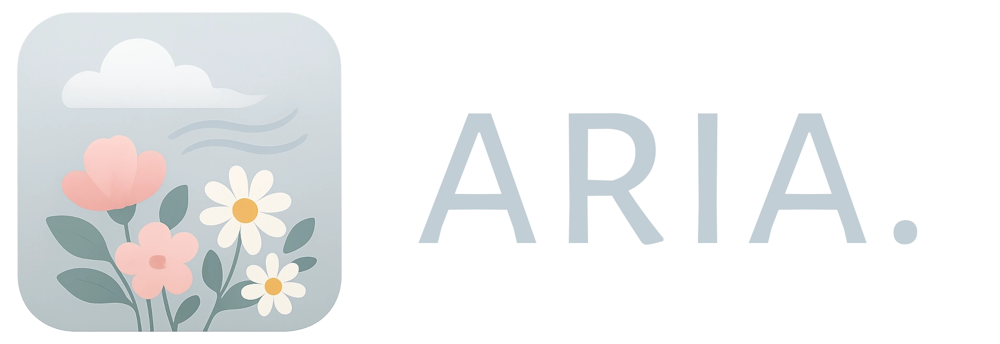

Nature’s silent symphony.
---

**Aria** is not just an ambient sound app — it's a tribute, a space to breathe, a gentle moment wrapped in sound and minimal design.

Built from scratch using [Compose Multiplatform](https://github.com/JetBrains/compose-multiplatform), **Aria** is designed to flow across platforms — from Linux to Windows, from macOS to Web — while honoring the quiet beauty of the original [Blanket app](https://github.com/rafaelmardojai/blanket), built by Rafael Mardojai for the GNOME desktop.

---

## 🌺 Goal of this project:

**Aria’s mission is simple:**  
To bring peace, calm, and ambient beauty — to more people, on more platforms.

This isn’t a fork or a reimplementation. It’s a handcrafted tribute.

A quiet attempt to capture the essence of **Blanket**, but retold with different tools, for different platforms, and with a different heartbeat — mine.

Designing for minimalism doesn’t mean removing life. It means focusing on **what truly matters**, and letting nature speak, softly and clearly.

---

## 🌼 Features

- 🎵 A curated library of ambient nature sounds: rain, fire, birds, forest, and more
- 🎛️ Click on any sound to play it; mix multiple tracks freely — they blend seamlessly
- 🎚 Per-sound volume sliders + master volume control
- 🕰 Built-in timer to gently fade out after a chosen duration (perfect for sleep)
- 🌗 Seamless dark/light theme support with soothing, intentional colors (Whispering Nature palette)
- 🪟 Inspired by Mica and GTK aesthetics — minimal, calm, elegant
- 💻 Runs on Desktop (Linux, Windows, macOS) and Web (WASM/JS), deployable via GitHub Pages
- ⚡️ Fast to load, pleasant to use, beautiful to look at, and quiet when not needed

> This is not a dashboard. It’s not a productivity tool.  
> It’s a moment of calm for anyone who needs it.


---

## 🌻 Setup

- Clone and build the project locally.

```bash
git clone https://github.com/kosail/aria.git
cd aria

# For WEB
./gradlew wasmJsBrowserDistribution

# For Desktop
./gradlew packageReleaseUberJarForCurrentOs
```

---

## 🔧 Stack & Resources
### Stack
- **Kotlin** — Main language
- **Compose Multiplatform (Desktop + WASM/JS)** — UI framework
- **libgdx Audio Module** — Audio library for Desktop Target (JVM) (Expected to be used) 
- **GitHub Pages** — For deployment

### Resources

<details>
<summary>Show/Hide</summary>

#### -> Icons
- [Original icons from Blanket, on GitHub](https://github.com/rafaelmardojai/blanket)
- [Lucide icons for minimize, maximize and close buttons](https://lucide.dev)


#### -> Fonts
- Font used in the banner: [Alegreya Sans SC. Designed by Juan Pablo del Peral, Huerta Tipográfica. Available on Google Fonts](https://fonts.google.com/specimen/Alegreya+Sans+SC)
- Main font: [Alegreya Sans. Designed by Juan Pablo del Peral, Huerta Tipográfica. Available on Google Fonts](https://fonts.google.com/specimen/Alegreya+Sans)


#### -> Audios
- [Cat meow audio by DRAGON-STUDIO, on Pixabay](https://pixabay.com/es/sound-effects/cat-meow-321642/)
- All the audios (except for the above) are the original ones used in Blanket. To see more information about the authors and licensing, please check [SOUNDS_LICENSING](SOUNDS_LICENSING.md).

#### -> Images
- [Rain photo by Anant Jain, on Unsplash](https://unsplash.com/photos/raindrops-on-clear-window-Bu1zj2WbjHE?utm_content=creditCopyText&utm_medium=referral&utm_source=unsplash)
- [Lightnings photo by Hakan TAHMAZ, on Unsplash](https://unsplash.com/photos/a-couple-of-lightning-strikes-over-a-body-of-water-yco4uLragVg)
- [Wind photo by Saad Chaudhry, on Unsplash](https://unsplash.com/photos/shallow-focus-of-white-dandelion-YNM4KStg78I)
- [Waves photo by Ivan Stepanov, on Unsplash](https://unsplash.com/photos/a-surfboard-sitting-on-top-of-a-sandy-beach-KCazjPomUbg)
- [Stream photo by Daniel Salcius, on Unsplash](https://unsplash.com/photos/a-rock-in-the-water-ckTkPtKwz_s)
- [Birds photo by Rusty Watson, on Unsplash](https://unsplash.com/photos/two-small-birds-perched-on-a-twig-KLylpBvo0ww)
- [Summer night photo by Ivan Maljarenko, on Unsplash](https://unsplash.com/photos/a-house-in-the-middle-of-a-field-under-a-night-sky-5ZHWVZpudpE)
- [Train photo by Adrien Bruneau, on Unsplash](https://unsplash.com/photos/woman-standing-on-waiting-shed-facing-speeding-green-and-white-train-KqeC2k_HkJc)
- [Boat photo by Michal Janek, on Unsplash](https://unsplash.com/photos/white-boat-on-large-body-of-water-during-daytime-WwMeY7eLd0A)
- [City photo by Caroline Ross, on Unsplash](https://unsplash.com/photos/a-city-street-with-cars-parked-on-the-side-of-it-gSdfjG5hhQs)
- [Coffee photo by Muskan Dev, on Unsplash](https://unsplash.com/photos/a-table-with-a-coffee-pot-and-a-book-on-it-di8qgeE1h_M)
- [Fireplace photo by Andrey Novik, on Unsplash](https://unsplash.com/photos/burning-wood-on-brown-soil-TpeIW_XnwI4)
- [Person standing on rock by Hunter Bryant, on Unsplash](https://unsplash.com/photos/person-standing-on-rock-oZMgy8s1Mh8)
- [Waves rushed to shore by Christian Holzinger, on Unsplash](https://unsplash.com/photos/waves-rushed-to-shore-at-sunset-3rcIXVAHpl0)
- [Cat photo, by Sabina Sturzu, on Unsplash](https://unsplash.com/photos/orange-tabby-cat-on-black-book-sHtJeNIzPe8)
- [A blurry photo of a city by Oskars Sylwan, on Unsplash](https://unsplash.com/photos/a-blurry-photo-of-a-city-at-night-Xjg8t1KO26o)

</details>

---

## 💐 Contributing
Contributions are welcome!
Feel free to fork the repository and submit pull requests.
If you have ideas, suggestions, or bug reports, open an issue on GitHub.

Sound designers: If you have original nature loops and would love to contribute them to Aria, reach out!

[//]: # (---)

[//]: # ()
[//]: # (## 🎒 What I learned from this project)

---

## 📜 License


[GPLv3 (GNU General Public License v3)](COPYING.txt) – Free to use, modify, and distribute as long as this remains open source, and it is not use for profitable purposes.

GPLv3 Logos:

    Copyright © 2012 Christian Cadena
    Available under the Creative Commons Attribution 3.0 Unported License.

---

Aria Copyright © 2025, kosail
<br>
With love, from Honduras.
